  <!-- BANNER SVG ANIMADO -->
  

    

  <!-- BADGES / SOCIAL -->
  
  
  

---

### 👨‍💻 Sobre Mim

Sou **Gabriel Guadalup**, Graduando em **Inteligência Artificial** pelo Instituto Federal do Amapá (IFAP) em Macapá. 

🔭 Estudando agora: Estruturas de Dados, Programação Orientada a Objetos (POO), Cálculo e Arquitetura de Computadores.
🛠️ Praticando: Python, lógica de programação, automações e versionamento com Git/GitHub.
🤝 Quero colaborar em: Projetos open-source em Python, análise de dados e aplicações com IA.
💼 Aberto a: Oportunidades de estágio e projetos na área de tecnologia.

---

### 🛠️ Linguagens e Ferramentas

  
  
  
  
  
  
  

---

### 📊 Estatísticas e Atividade

  <!-- GITHUB STREAK STATS -->
  

    

  <!-- GITHUB STATS & TOP LANGS -->
  

    

  
  

    

  
  

    

  <!-- CONTADOR DE VISITAS -->
  

---

  
<i>"Aprendendo em público e construindo soluções."</i> 🚀

  
###

<picture data-importer="pacman">
  <source media="(prefers-color-scheme: dark)" srcset="https://raw.githubusercontent.com/GabrielGuadalup1/GabrielGuadalup1/pacman-output/bomberman-contribution-graph-dark.svg?game=bomberman">
  <source media="(prefers-color-scheme: light)" srcset="https://raw.githubusercontent.com/GabrielGuadalup1/GabrielGuadalup1/pacman-output/bomberman-contribution-graph.svg?game=bomberman">
  
</picture>

###

